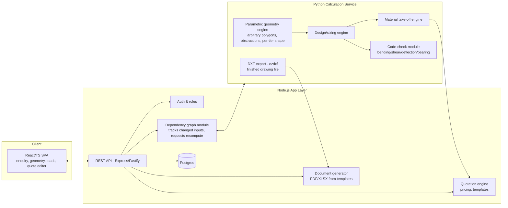

# Mezzanine Design & Quoting Software — Build Plan

This plan turns the domain brief (mezzanine designer/quoting-specialist prompt) into an actionable
software build plan. It's organized so Phase 1 delivers a genuinely usable MVP for live quoting,
with clear extension points for the nice-to-have list later.

**Stack decision (per brief):** Python for all engineering/calculation/take-off logic, exposed as a
service; Node.js for the application layer (API orchestration, auth, quoting workflow, document
generation, UI). Postgres for persistence. React (TypeScript) for the front end.

**Design principle added in this revision:** the tool must handle *unconventional* footprints
(non-rectangular, angled, multiple obstructions, per-tier variation) and must recalculate the whole
downstream chain — grid, member sizing, BOM, price, drawings — every time *any* input changes,
quickly and incrementally rather than as a one-shot batch run. This is treated as a cross-cutting
architectural requirement, not a bolt-on feature — see the new sub-section under Build Phases and
the revised data model below.

---

## 0. Open decisions to confirm before Phase 1 starts

These affect the calculation engine and must be locked early — flag to the domain expert/stakeholder:

1. **Design code** for member sizing (Eurocode 3 / AISC 360 / AS 4100 / BS 5950). Default assumption
   below: **Eurocode 3 (EN 1993-1-1)** with a simplified/conservative rule set, but the section
   library and code-check module must be pluggable per region from day one (this is cheap to do now,
   expensive to retrofit).
2. **Section library source** — which steel catalogue(s) to ship (e.g. UB/UC/PFC to EN 10365, or
   local supplier catalogue). MVP ships with one catalogue; architecture supports more.
3. **Currency/region for price book** — single region for MVP, multi-region is nice-to-have.
4. **Who are the first 3–5 pilot users** (sales engineers) who will validate the quoting workflow.
5. **Constraint-solving approach for irregular geometry** — MVP uses a deterministic rule-based
   solver (heuristics + validity checks) rather than a full optimizer. This is the pragmatic choice
   for speed and explainability in a sales tool; a true optimizer (minimizing steel weight/cost
   across constraints) is a Phase 6+ upgrade once the rule-based engine's outputs are trusted.

---

## 1. Architecture overview



- **Node.js app layer** owns: projects/enquiries, users/roles, price book CRUD, quote template
  rendering, revision history, PDF/Excel assembly, the change-impact dependency graph (a module
  inside this layer, not a separate service), and the UI API.
- **Python service** (FastAPI) owns: geometry validation, grid/member selection, structural code
  checks, bill-of-materials generation, and the **finished DXF file** (via `ezdxf` — Python owns DXF
  end-to-end, since it already holds the geometry; Node does not re-render drawing primitives). Keep
  it a stateless service called synchronously per design run — no need for a job queue at MVP scale
  (single design request completes in seconds).
- Communication: Node → Python over internal HTTP/JSON (or gRPC if latency matters later). Python
  never talks to Postgres directly at MVP — Node persists results. Keeps one source of truth for data
  and simplifies auth/audit.

---

## 2. Repository structure

```
mezzanine_design/
  apps/
    web/                 # React + TS SPA
    api/                 # Node.js (TypeScript) app layer
  services/
    calc-engine/         # Python (FastAPI) design/BOM/code-check service
  packages/
    shared-types/        # OpenAPI-generated / shared TS+Python schema contracts
  docs/
    domain-requirements.md   # the answered domain brief (see Phase 0 deliverable)
    api-contracts.md
  infra/
    docker-compose.yml   # postgres + api + calc-engine + web, for local dev
  PLAN.md
```

Use a single monorepo so schema changes (data model) are reviewed atomically across UI/API/engine.

---

## 3. Build phases

### Phase 0 — Domain spec & data contracts (foundation, no app code yet)
**Goal:** remove ambiguity before writing engineering logic.
- Produce `docs/domain-requirements.md`: the fully answered 10-section brief (target users/use
  cases, workflow, must/nice-to-have features, data model, design rules, pricing structure, outputs,
  constraints/risks, success metrics, worked example). This is the spec every later phase is graded
  against.
- Confirm the Section 0 open decisions above.
- Define the shared JSON schema for: Enquiry, Geometry, LoadCase, DesignResult, BOMLine, PriceBookEntry,
  Quote. This schema is implemented once and shared (OpenAPI spec + generated Python Pydantic models +
  TS types) so the Node/Python boundary never drifts.
- **Exit criteria:** schema reviewed and frozen for MVP scope; two worked examples documented as
  golden test cases with expected inputs/outputs — (1) the straightforward case from Section 10 of
  the brief (20×12 m, single-tier, 4.5 m clear height, 5 kN/m² storage) and (2) a deliberately
  unconventional case (e.g. an L-shaped footprint with an existing column obstruction, a
  height-restricted zone under a roof truss, and a smaller tier-2 footprint) so the polygon/obstruction
  model is validated from day one, not bolted on after the rectangular case works.

### Phase 1 — Calculation engine core (Python)
**Goal:** given geometry + loads, return a structurally sound design and a full BOM. This is the
highest-risk, highest-value piece — build and validate it before any UI polish.
- Geometry module built on a general **polygon model** (not hardcoded rectangle/L-shape cases):
  boundary defined as an ordered vertex list (supports rectangular, L/T/U-shape, angled walls,
  non-90° corners), plus zero-or-more **obstruction polygons** inside the boundary (existing columns,
  plant, voids, lift shafts, ramps) and zero-or-more **access-point** markers on the boundary edge.
  Validates spans/edge distances against any boundary shape, not just orthogonal ones.
- Per-tier geometry override: each tier can have its own boundary/obstructions/clear height (a common
  real case — e.g. tier 2 footprint smaller than tier 1, or a void over a loading bay) rather than
  assuming every tier repeats the ground-floor footprint.
- Constraint zones: height-restricted zones (e.g. under a roof truss or existing beam), no-go zones
  (can't place a column), and mandatory-clear zones (aisles/doors) — the grid generator must treat
  these as hard constraints, not just visual annotations.
- Grid generator: proposes column grid(s) for a given footprint using economical span heuristics
  (typical secondary beam spans, primary beam spans, column spacing bands), then **adjusts the grid
  to respect obstructions/constraint zones** — nudging or skipping column positions, and re-spanning
  adjacent bays when a column is blocked, rather than failing outright. Rule-based (see Section 0
  decision #5), with clear flags raised whenever a heuristic had to deviate from the "ideal" grid.
- Member sizing: joists → secondary beams → primary beams → columns, using code checks (bending,
  shear, deflection vs span/360 or /200 as configured, bearing, basic column buckling). Sizing logic
  must work off *actual computed spans* (which vary bay-to-bay once obstructions shift the grid), not
  a single assumed span for the whole floor.
- Baseplate default-sizing logic (assumed bearing pressure when soil/slab data unknown, per brief).
- Bracing rule-of-thumb placement (vertical bracing bays at defined intervals/perimeter rules),
  adapted to skip bays that coincide with access points or obstructions.
- BOM engine: converts sized members + decking + bracing + connections into quantities (linear m,
  m², count) with wastage factors applied, including irregular-bay decking take-off (non-rectangular
  panels around cut-outs/obstructions).
- Output: structured `DesignResult` (member schedule, per-bay spans, grid, bracing layout,
  assumptions/flags raised) + `BOMLine[]`.
- Unit tests against 3–5 hand-calculated reference cases (including the Phase 0 golden example) plus
  at least one deliberately irregular case (L-shape with an obstruction and a height-restricted zone)
  — this is non-negotiable given it's replacing engineering judgement in a sales tool.
- **Exit criteria:** golden example *and* the irregular test case each produce a plausible,
  code-checked design in <2 seconds, with every assumption/deviation explicitly listed in the
  response (not silently applied).

### Phase 2 — App layer, data persistence, and enquiry-to-design workflow (Node.js)
**Goal:** a sales user can create an enquiry, enter geometry/loads, and get a design back.
- Auth + roles (internal designer, sales, admin — read the brief's user list; keep roles minimal).
- Enquiry/project CRUD, with sensible defaults pre-filled per use case (matches Section 4 of brief:
  imposed load defaults by usage type, default deflection limits, etc.).
- Wraps Python `/design` endpoint; persists `DesignResult` + revision number against the project.
- **Change-impact engine (dependency graph):** every input (geometry vertex, obstruction, tier count,
  load, deflection limit, grid override) is a node; grid, member sizing, BOM, price, and drawings are
  downstream nodes. **Decision (settled, not deferred): Phase 1–5 always trigger a full recompute**
  via the Python `/design` endpoint (target <2s, already validated as achievable in Phase 1) — the
  dependency graph's job for MVP is only to produce the **impact report** (diffing old vs new
  `DesignResult` to say what changed and what's now invalid, e.g. "beam B12 no longer meets deflection
  after grid shift — resized from 356x171x51 to 406x178x60"), not to drive a partial/incremental
  recompute. Shape the `/design` request/response contract so it *can* later accept a prior
  `DesignResult` + a diff and return a partial update without a breaking change — but building that
  path is explicitly out of scope until Phase 6+ (see Section 0 decision #5 and Phase 6+ backlog).
  This still generalizes the brief's "what-if repricing" must-have to geometry changes, which is the
  main source of quoting churn on real irregular buildings — it just does it by being fast at full
  recompute rather than by being incremental.
- Every change is stored as a new **input revision**, never overwritten in place, so a sales user can
  compare "before/after" and roll back a change that made the design worse.
- **Exit criteria:** end-to-end round trip — create enquiry → set geometry/loads → get back a design
  + BOM → save as a named revision — through the API; then mutate one geometry input (e.g. add an
  obstruction) and confirm only the affected bays/members/BOM lines are recalculated and reported
  back as a diff (UI can still be rough here).

### Phase 3 — Pricing engine & quotation generation (Node.js)
**Goal:** BOM → priced, professional, exportable quote in minutes.
- Price book data model: categories (structure, decking, handrail, stairs, fire protection, paint,
  install/labour, delivery, design fee, contingency), unit + rate, regional multiplier, effective
  dates. Admin CRUD UI for the price book (must be configurable without a code change — explicit
  must-have in the brief).
- Ancillary item catalogue (stairs, pallet gates, handrail runs, gates) as selectable add-ons with
  their own quantity logic (e.g. stairs priced per flight/rise, not per m²).
- Quote assembly: BOM lines × price book → line-item quote with markup/overhead/contingency applied;
  supports multiple options in one quote (e.g. base load vs upgraded load, with/without fire rating)
  as line-item alternates rather than separate documents.
- Assumptions & exclusions block generated automatically from the flags raised in Phase 1's
  `DesignResult` (e.g. "soil bearing capacity assumed at X kPa — confirm on site") — this closes the
  loop between engineering assumptions and what the client is told, which is the single biggest
  source of quoting risk per the brief.
- Configurable quotation template (Word/Excel/PDF) — templating approach: store a template with
  merge fields, render with real data. Don't hardcode a single layout.
- **Exit criteria:** a full quote (line items, options, assumptions/exclusions, program/lead time)
  can be generated and exported for the golden example in under a defined number of clicks from the
  saved design.

### Phase 4 — Outputs: drawings and documents
**Goal:** the outputs a client actually receives, generated automatically.
- Sales drawing export (DXF + PDF): plan view with grid, key dimensions, tier heights, access points,
  north point/title block. Generated from the geometry+grid data already in `DesignResult` — **Python
  emits the finished DXF file directly** (via `ezdxf`, no primitive hand-off); Node separately
  produces the PDF via its own print-friendly HTML→PDF template (dimension callouts rendered from the
  same `DesignResult` data, not derived from the DXF).
- Material summary/take-off document (client-facing simplified version + internal detailed version).
- Quotation PDF/Word export using the Phase 3 template engine.
- Design summary / assumptions log as an internal-only report (audit trail for the human reviewer).
- **Exit criteria:** from one saved design, a single action produces: quote PDF, sales drawing
  PDF+DXF, material take-off, and internal design summary — matching the brief's Section 7 outputs.

### Phase 5 — Pilot, validation, and hardening
**Goal:** confirm the MVP is trustworthy and usable by real sales/design users.
- Run the pilot users (Section 0) through 5–10 real past enquiries; compare generated design/BOM/quote
  against what was actually quoted manually. Track discrepancies.
- Add the human-review checkpoint explicitly into the workflow (brief Section 8: no quote should be
  sent without a reviewer flag being clearable) — e.g. a required "reviewed by" state before export.
- Instrument the success metrics from Section 9 of the brief (time to first quote, revisions per
  quote, error rate) from day one so the pilot has real numbers.
- Fix validation gaps found in the Phase 1 engine before wider rollout — do not expand geometry/load
  scope until the rectangular/simple case is solid.

### Phase 6+ — Nice-to-have backlog (post-MVP, sequence by pilot feedback)
- Partial/incremental recompute in the calc engine (e.g. "only re-check bays touching this
  obstruction") to replace MVP's always-full-recompute approach — only pursue once pilot usage shows
  full recompute (<2s target) is actually too slow in practice, not preemptively.
- True optimization solver for grid/member layout (minimize steel weight/cost across all constraints)
  to replace/augment the rule-based heuristics from Phase 1 (Section 0, decision #5).
- Curved or non-planar boundaries (curtain walls, radial buildings) beyond straight-edge polygons.
- Advanced fire-rating configurations.
- Sloped/uneven slab levels requiring stepped column base levels within one tier.
- CRM/ERP integration (push won quotes into ERP as sales orders).
- Automated fabrication drawings / CNC-ready output.
- Multi-region price books and multi-code (design standard) support if not already generalized.

### Cross-cutting: geometry flexibility & dynamic recalculation
This isn't a separate phase — it's a constraint on how Phase 1 and Phase 2 are built, called out
separately because it's easy to accidentally hardcode away:

- **Model geometry as data, not cases.** Never branch code on "is this rectangular or L-shaped";
  always operate on the general polygon + obstructions + constraint-zone model. Rectangular and
  L-shape are just simple instances of the same model, not special code paths.
- **Treat every design as a live, recomputable graph, not a one-shot script — but MVP recomputes in
  full, every time.** Phase 1–5 always run a full-floor recompute (target: <2s for a ~250 m² floor)
  and rely on the impact-report diff (old `DesignResult` vs new) to tell the user what changed, rather
  than trying to only re-check bays touching an obstruction. Partial/incremental recompute is a
  deliberate Phase 6+ upgrade, not a fallback to reach for early — don't build it until the full
  recompute path is proven too slow in real pilot usage.
- **Never silently auto-fix a constraint conflict.** If an obstruction blocks the "ideal" column
  position, the engine picks the best rule-based alternative *and* raises a flag — this keeps the
  human reviewer (Section 8 of the domain brief) in the loop for anything unconventional, which
  matters more as geometry gets less standard.
- **Keep the constraint vocabulary small and explicit for MVP:** boundary polygon, obstruction polygon,
  no-go zone, height-restricted zone, access point, per-tier override. Resist adding bespoke constraint
  types ad hoc — new real-world cases should map onto this small vocabulary; if they can't, that's a
  deliberate scope decision, not a quick hack.

---

## 4. Data model (MVP scope)

Implement as the shared schema from Phase 0. Key entities:

| Entity | Key fields | Notes |
|---|---|---|
| `Project/Enquiry` | client, site address, contact, usage type, source/lead, status | usage type drives load defaults; the one entity that's mutated in place (it's a record, not a computed state) |
| `DesignRevision` | project ref, revision #, created_at, created_by, **full input snapshot** (geometry, tiers, obstructions, constraint zones, load case, structural config — one JSONB payload), **full output snapshot** (`DesignResult` + `BOMLine[]`, another JSONB payload), status (draft/reviewed/superseded) | **the unit of versioning** — see note below |
| `ChangeImpactLog` | from revision # → to revision #, changed input path(s), affected members/BOM lines, human-readable diff summary | generated by diffing two `DesignRevision` output snapshots; powers the Phase 2 change-impact engine and audit trail |
| `PriceBookEntry` | category, unit rate, region, effective date | admin-managed, genuinely independent of project revisions — kept as its own versioned table |
| `Quote` | revision ref (→ `DesignRevision`), line items, options[], markup/overhead/contingency, assumptions/exclusions text, program/lead time, line-item edit overrides (diff against generated lines) | one `Quote` per `DesignRevision`; edits are stored as an overlay, not a new entity-version chain |

**Note on the revision model (simplified from earlier per-entity versioning):** rather than versioning
`GeometryInput`, `LoadCase`, `StructuralConfig`, `DesignResult`, and `BOMLine` independently — which
would mean every "revision" is really a bundle of foreign keys into five separate version chains —
each `DesignRevision` is a **single immutable snapshot** of the full input state and the full computed
output state for one point in time. "Compare before/after" is just diffing two `DesignRevision` rows;
"roll back" is pointing the project at an older revision # as current. Structured indexed columns
(usage type, floor area, tier count, load) can sit alongside the JSONB payload for querying/reporting
without needing to normalize the whole state. This is what makes "what-if repricing," the geometry
change-impact engine, and the "revisions per quote" success metric possible without a proliferation of
version-chain tables.

---

## 5. Technology choices (concrete)

- **Python service:** FastAPI + Pydantic (schema validation matching shared contracts), NumPy for
  section-property calcs, `Shapely` for polygon/geometry operations (containment, intersection,
  offset checks between obstructions/constraint zones and the proposed grid), a small internal
  section-library dataset (CSV/JSON, not a DB dependency), `ezdxf` for drawing geometry export.
- **Node.js app layer:** TypeScript, Fastify or NestJS (NestJS if the team wants structure/DI for
  quoting + templating modules), Prisma or Drizzle ORM against Postgres. Change-impact engine is a
  plain dependency graph (topological sort over input→derived-output edges) — no need for an
  external workflow/DAG product at MVP scale; keep it as a well-tested internal module.
- **Document generation:** a templating library for Word (`docx` templating) and/or headless
  PDF rendering (e.g. HTML→PDF via a print-ready template) for the quote; keep the quote template
  itself as data (merge-field document), not hardcoded logic.
- **Frontend:** React + TypeScript, a form-heavy UI (enquiry → geometry → loads → review) plus a
  quote editor (line items, options, assumptions), a price book admin screen, and a lightweight
  polygon-drawing/editing canvas (boundary + obstructions + constraint zones) since irregular geometry
  input needs more than plain length/width fields.
- **Testing:** Python side needs engineering-reference unit tests (golden examples, including the
  irregular/obstruction case) as a hard gate; Node side needs workflow/integration tests (enquiry →
  design → quote → export round trip) plus change-impact tests (mutate one input, assert only the
  expected downstream nodes recompute).

---

## 6. Immediate next steps

1. Confirm Section 0 decisions (design code, section catalogue, region, pilot users, constraint-
   solving approach).
2. Write `docs/domain-requirements.md` — the fully answered 10-section brief — as the frozen spec.
3. Scaffold the monorepo (`apps/web`, `apps/api`, `services/calc-engine`, shared schema package,
   docker-compose for local Postgres).
4. Build both Phase 1 golden examples end-to-end in the Python service — the straightforward
   rectangular case *and* the irregular/obstruction case — before writing any UI, so the polygon
   model and change-impact hooks are proven early rather than retrofitted.
