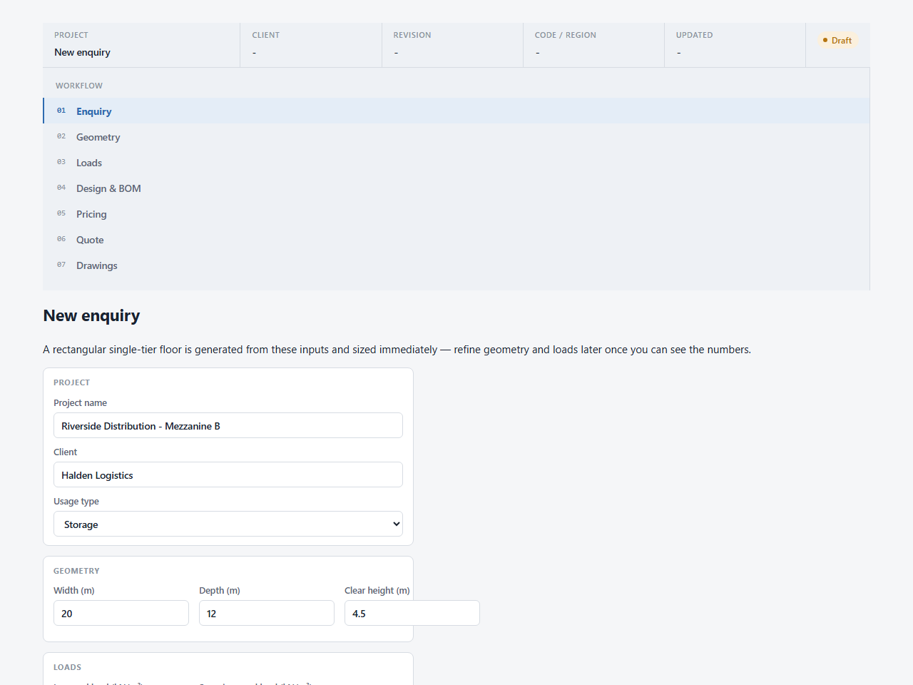
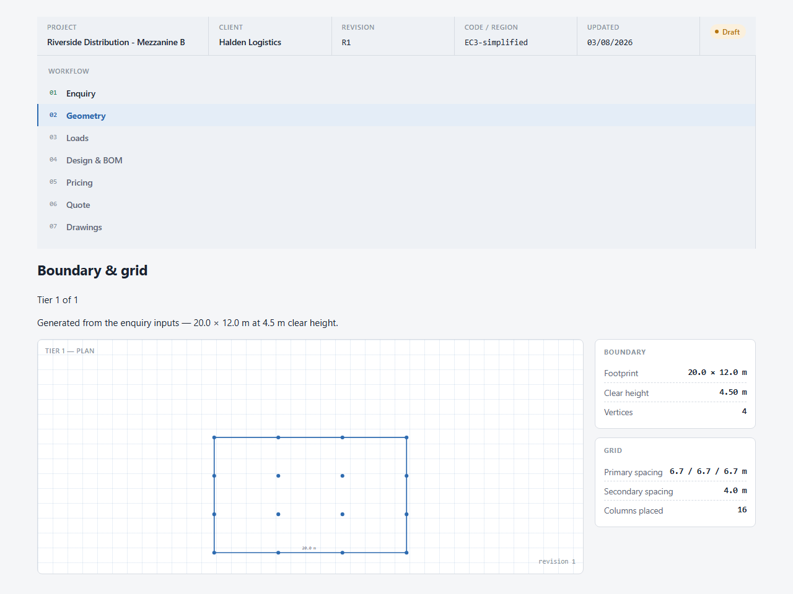
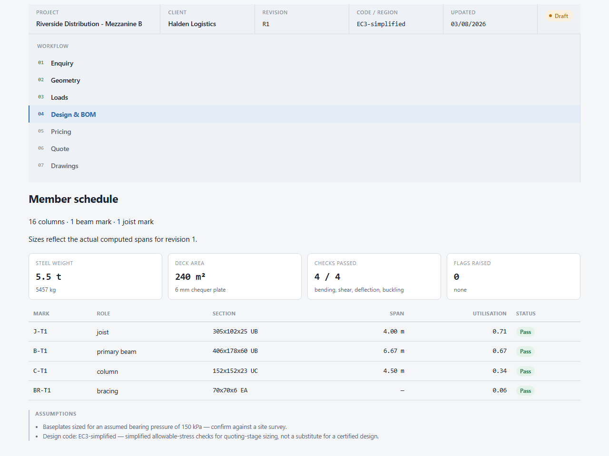
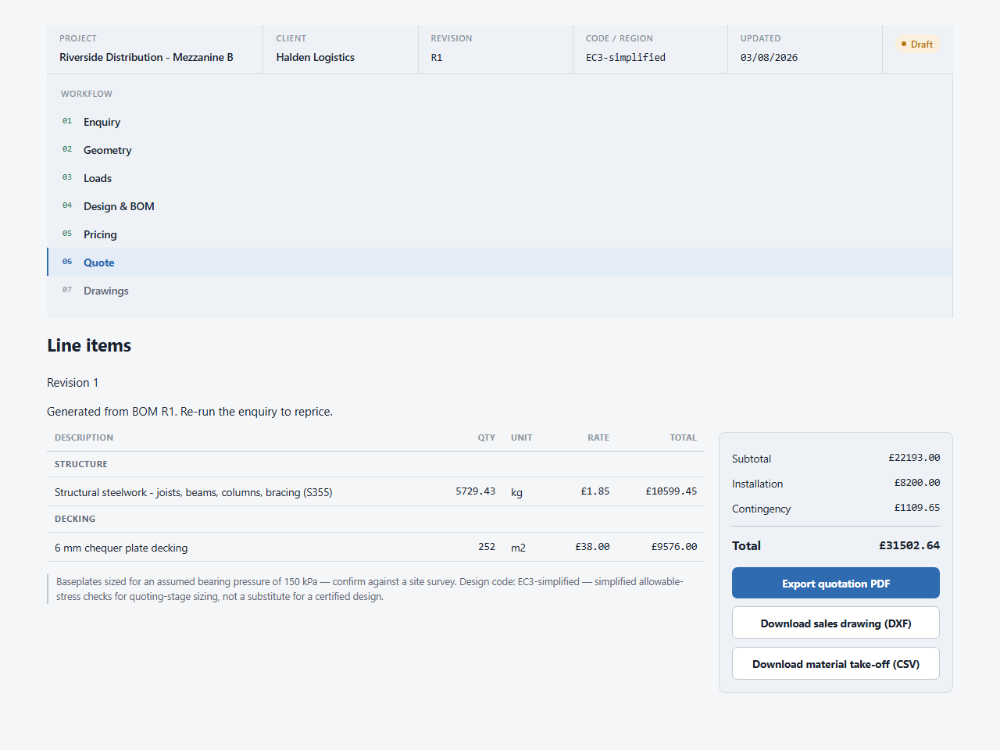
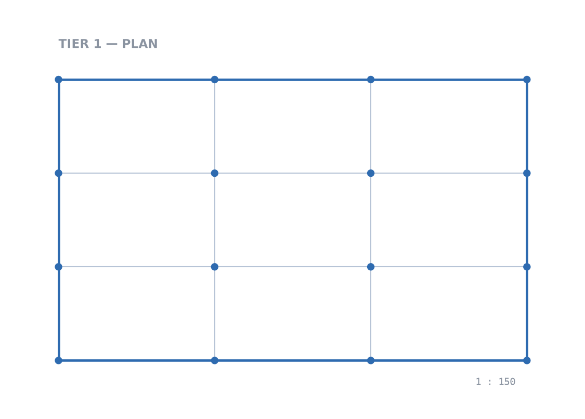

# apps/web

React + TypeScript single-page app (Vite) for the mezzanine design/quoting workflow: enquiry
intake, geometry and grid review, design and BOM review, and quote generation with document
exports.

| Enquiry | Geometry & grid | Design & BOM | Quote |
|---|---|---|---|
|  |  |  |  |

The Quote screen's DXF download produces the sales drawing directly from `services/calc-engine`:



## What this actually is right now

This app is a thin client over two backend services — it does not run any structural calculations
or store any data itself. Every screen after Enquiry reads data that was computed by
`services/calc-engine` and persisted by `apps/api`. If those two services (and the Postgres
database behind `apps/api`) are not running, the app will render its shell but every action that
touches data will fail.

**Implemented and wired to live data:**

- **Enquiry** — project info, an interactive polygon canvas per tier (click to place boundary
  vertices, drag to move them, add obstructions and constraint zones, curve an edge with the arc
  tool, type an exact segment length instead of eyeballing it), multi-tier support (add/remove
  tiers, each with its own geometry and clear height), and loads. Submitting calls `apps/api` to
  create a `Project` and its first `DesignRevision`, computed synchronously by
  `services/calc-engine`. Arcs are tessellated into straight segments client-side before being
  sent, since the calc engine's geometry model only accepts straight-edge polygons.
- **Geometry** — renders the boundary polygon, obstructions, constraint zones, and the generated
  column grid for the current revision as an SVG, scaled from the real coordinates returned by
  the calc engine, with a tier selector for multi-tier revisions. Any flags (e.g. a column nudged
  or omitted to clear an obstruction) are shown as callouts.
- **Design & BOM** — the member schedule (mark, role, section, span, utilisation, pass/review
  status), summary stats (steel weight, deck area, checks passed, flags raised), and the
  assumptions list, all read directly from the revision's stored output.
- **Quote** — generates (or fetches, if one already exists) a priced quote for the revision,
  showing line items by category and totals (subtotal, installation, contingency, grand total),
  with a link to the PDF export.
- **Loads** — shows the current load case and lets you change it. Submitting creates a *new*
  design revision (geometry unchanged) rather than mutating the current one, then shows the
  change-impact report between the old and new revision (resized/added/removed members,
  steel-weight and checks-passed deltas, new/resolved flags) via `apps/api`'s diff endpoint.
- **Pricing** — a full price-book admin table: add, inline-edit, and delete rate entries. Talks
  directly to `apps/api`'s `/price-book` CRUD routes.
- **Drawings** — the same boundary/grid preview as Geometry (shared `FloorPlanSvg` component,
  with the same tier selector), plus the DXF and material take-off CSV downloads (moved here from
  Quote).

**Known limitation:** curved boundaries only exist as an editing convenience — the arc tool
tessellates into a many-sided polygon before it's ever sent to the API, so the calc engine, BOM,
and DXF all see (and report vertex counts for) straight segments, not a true arc primitive.

## Running it for real (full local stack)

You need all three pieces running at once for anything beyond the Enquiry form's first screen to
work:

```
# 1. Postgres (from repo root)
docker compose -f infra/docker-compose.yml up -d postgres

# 2. Calculation engine (services/calc-engine)
cd services/calc-engine
python -m venv .venv && .venv/Scripts/activate   # or source .venv/bin/activate
pip install -r requirements.txt
uvicorn app.main:app --reload --port 8000

# 3. App layer (apps/api)
cd apps/api
cp .env.example .env
npm install
npx prisma migrate dev
npm run seed
npm run dev   # http://localhost:3001

# 4. This app (apps/web)
cd apps/web
cp .env.example .env   # VITE_API_URL defaults to http://localhost:3001
npm install
npm run dev   # http://localhost:5173
```

Then open `http://localhost:5173`, fill in the Enquiry form, and submit — that calls
`apps/api`, which calls `services/calc-engine`, persists the result to Postgres, and returns it.

## About the GitHub Pages deployment

`https://0r1xbyte.github.io/mezzanine_design/` is built and deployed automatically by
`.github/workflows/deploy-pages.yml` on every push touching `apps/web/**`. **GitHub Pages only
serves static files — it cannot run `apps/api`, `services/calc-engine`, or Postgres.** The
deployed build:

- sets `VITE_DEMO_MODE=true` at build time, which shows a banner explaining the limitation and
  turns network failures on the Enquiry form into a readable message instead of a silent/blank
  failure;
- otherwise behaves identically to a local build pointed at an unreachable API.

In other words: the Pages URL is useful for showing the visual design and the static shell, but
you cannot actually run an enquiry through it. To see the real workflow, run the full local stack
above. If/when the backend services get real hosting, point `VITE_API_URL` at that deployment
(via a repo/environment secret in the Pages workflow) and drop `VITE_DEMO_MODE`.

## Environment variables

| Variable | Default | Purpose |
|---|---|---|
| `VITE_API_URL` | `http://localhost:3001` | Base URL for `apps/api` requests. |
| `VITE_DEMO_MODE` | unset | When `"true"`, shows the static-preview banner and a friendlier network-error message. Only set by the Pages workflow. |

## Structure

```
src/
  api.ts                  # apps/api client — all fetch calls live here
  useTheme.ts              # light/dark mode state, persisted to localStorage
  geometryDraft.ts          # editable tier/obstruction/zone draft types used by the canvas
  arcMath.ts                # arc tessellation and exact-segment-length math
  styles/tokens.css        # design system tokens (light/dark)
  components/
    TitleBlock.tsx          # persistent project/revision header, styled like a drawing title block
    WorkflowRail.tsx         # left-hand step navigation
    PolygonCanvas.tsx         # interactive boundary/obstruction/zone editor (click, drag, arc tool)
    FloorPlanSvg.tsx          # read-only boundary/grid preview, shared by Geometry and Drawings
    TierSelector.tsx           # tier-switching pills, shown when a revision has >1 tier
    Chip.tsx                 # pass/review status chip
    ThemeToggle.tsx            # light/dark mode switch
    DemoBanner.tsx            # GitHub Pages static-preview notice
  screens/
    EnquiryScreen.tsx        # project info + PolygonCanvas per tier + loads -> first design revision
    GeometryScreen.tsx       # boundary/grid preview + grid stats, tier selector
    LoadsScreen.tsx           # edit loads -> new revision -> change-impact report
    DesignBomScreen.tsx      # member schedule + BOM summary
    PricingScreen.tsx         # price book admin (add/edit/delete)
    QuoteScreen.tsx          # generates/fetches the quote, links to the PDF export
    DrawingsScreen.tsx        # boundary/grid preview + DXF/CSV downloads, tier selector
  data/workflow.ts        # the seven workflow step definitions (Enquiry -> ... -> Drawings)
```

## Design system

Steel blue (`#2E6BB0`) is the one accent; amber/green/red are reserved for flag/warning/pass
states and never used decoratively. All dimensions, loads, quantities, and prices are set in a
monospaced face so the digits line up in columns. See the persistent title block on every screen —
it mirrors the revision/status metadata block on an actual drawing sheet, which is where the whole
visual direction comes from.
